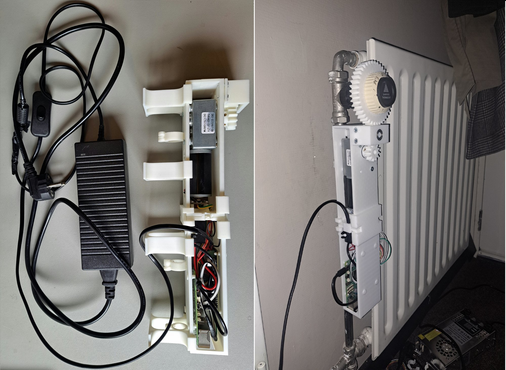
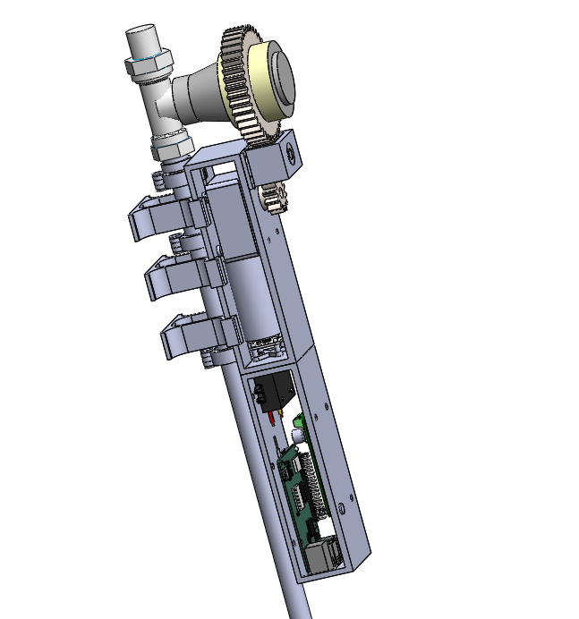
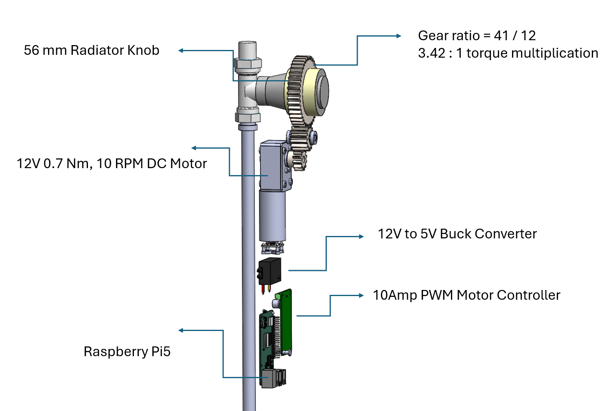
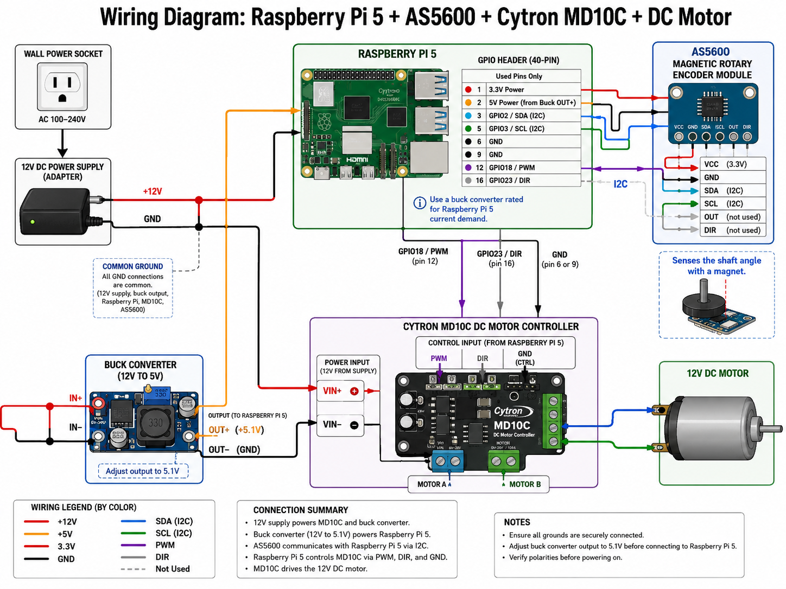

# Home Radiator Smartification

**Rachied Obispo** | Mechanical Engineer, Graduted with merit from the HAN University of Applied Sciences · [linkedin.com/in/rachied-obispo](https://linkedin.com/in/rachied-obispo)

Motor-driven retrofit that turns a manual radiator valve into a scheduled, phone-controllable heating system, with no screws, glue, or other permanent fixings, since the flat was rented.

## Why

Student housing in the Netherlands runs on manual thermostatic radiator valves (TRVs): a dial you turn by hand, no schedule, no remote control. Having grown up in a tropical climate, I wanted to wake up under the covers to an already-warm room, and fall asleep in a room that had already started cooling down, since people sleep better cool. I also kept forgetting to turn the heater down when I left the flat, which is both wasteful and, over a heating season, not cheap.

Rather than replace the valve with a commercial smart radiator head, I built a small motorized adapter that clamps onto the existing Danfoss valve and turns the stock dial for me, on a schedule, controlled from Home Assistant on my phone.

## Design constraints

Three constraints shaped the mechanical design more than anything electrical:

- **No permanent fixings -** I was renting, so nothing could be screwed or glued to the wall, the pipe, or the valve body. The entire housing had to clip on and come off clean, which is why it clamps around the radiator pipe instead of bolting to anything.
- **Heat -** The housing clamps directly onto the radiator pipe, and standard PLA softens well below what a hot-water pipe can reach. I printed it in PETG instead, since its higher heat resistance (glass transition around 80 °C, versus roughly 60 °C for standard PLA) was enough margin for the job, without the cost or printing difficulty of something like PC or nylon.
- **Compact and out of the way -** This sits on a radiator in a lived-in room, not a lab bench, so bulk wasn't free, and a big or ugly housing would have been a daily annoyance. The design had to stay tight to the pipe and valve rather than sprawl.

## How it works

A 3D-printed housing clips over the radiator pipe and holds a gear-reduced DC motor in line with the valve's thermostatic dial. A gear keyed to the motor shaft meshes directly with a printed gear ring around the dial, so the motor turns the *original* valve knob rather than replacing it, so the radiator's manual override still works if the electronics ever fail.

**Mechanical:**
- 12 V, 0.7 N·m, 10 RPM DC gearmotor
- Custom 3D-printed gear pair, 41:12 tooth ratio → 3.42:1 torque multiplication at the valve
- 56 mm printed gear ring clamped around the Danfoss dial
- Printed housing clips onto the radiator pipe, with no permanent modification to the radiator or valve

**Electronics:**
- Raspberry Pi 5 as the controller
- Cytron MD10C 10 A PWM motor driver (PWM + DIR + GND from the Pi's GPIO)
- AS5600 magnetic rotary encoder on the motor shaft for closed-loop shaft-angle feedback over I2C
- 12 V→5.1 V buck converter to run the Pi from the same supply as the motor, sized for the combined draw of both
- Single 12 V DC supply for the whole assembly, common ground across supply, buck converter, Pi, driver, and encoder

**Full Assembly: Housing with Rotational Support**

**Labeled Component: Valve knob, Drivetrain gear ratio, DC motor, Buck converter, Motor controller, Raspberry Pi 5, AS500 Magnetic Rotary Encoder**

**Full wiring diagram:**

**Control:** The Pi runs a scheduler that drives the motor to timed dial positions (e.g., open before I wake up, close before bed) and exposes control to [Home Assistant](https://www.home-assistant.io/), so I could turn the schedule on/off or override it from my phone from anywhere.

## The moment problem

The Danfoss valve on this particular radiator was old and stiff, and turning it took noticeably more torque than a fresh valve would. That exposed a problem the no-permanent-fixings constraint had quietly created: because the housing could only clamp around the pipe rather than bolt rigidly to the wall or the valve body, the reaction torque from turning a stiff knob had nowhere to go. Basic action-reaction, whatever torque the motor puts into the valve, an equal and opposite torque pushes back on the motor's own mount, and with nothing resisting that reaction, it just spun the *entire housing* around the pipe instead of turning the knob. `moment-problem.mp4` shows it: the housing rotating on the pipe, the knob barely moving.

`Troubleshooting.mp4` is me diagnosing it by hand, isolating whether the motor itself was underpowered or whether the mount was the real problem. It was the mount: the clamp gave the housing one rotational degree of freedom too many.

The fix couldn't be a screw or a bracket into the wall, since that would have broken the original design requirement. Instead I added a series of support wedges along the length of the housing, each shaped to make precise, friction-tight contact between the housing profile and the wall behind it: not fastened, just dimensioned accurately enough (precision 3D printing and careful assembly) to seat snugly at multiple points along the housing rather than one. Spreading the contact along the length reacted the torque into the wall far more effectively than a single point could, removing the housing's last rotational degree of freedom around the pipe without a single screw or drop of glue, so the motor's torque went into turning the knob instead of spinning the housing. `Moment Problem_Partially Solved.mp4` shows it working, and I've called it "partially solved" there isn't an updated documentation video of the build refined with all the support brackets along the length of the housing as seen in the CAD assembly.

## Outcome

The finished system ran the actual heating schedule in my room for about three months, automated, controlled from my phone via Home Assistant, no manual dial-turning. It delivered exactly what I'd set out to build: a warm room to wake up into, a cooling room to fall asleep in, and one less thing to remember when leaving the flat. It wasn't discontinued because it stopped working, I needed the Raspberry Pi 5 for a different project and hadn't built a second unit, so it's been sitting unused since.

This was my mechanical engineering degree's "flexible project": a self-chosen, self-scoped assignment worth 80 hours. What the course actually graded wasn't build polish, it was planning, project management, and presentation: writing a plan of approach, managing scope and time against it, and presenting the result convincingly. Within that, I planned, managed, and built the thing independently, CAD design and torque calculations, 3D printing and assembly, electronics integration and power budgeting, control code, and the Home Assistant integration all mine end to end. My supervisor, who I reported progress to against my own plan of approach, assessed it well specifically because it touched design, electronics, software, and manufacturing in one project, and was particularly interested in the phone control via Home Assistant.

## What's in this repo

Because the assignment was graded on planning, management, and presentation rather than on production-grade deliverables, the CAD files and control code were treated as working files, not something to document for reuse, and they were never cleaned up and aren't in a shareable state today. What's preserved is the presentation record instead:

- `cad-hero.png`, CAD assembly render
- `cad-stack.png`, labeled CAD component stack (knob, gear ratio, motor, buck converter, motor controller, Pi 5)
- `wiring-diagram.png`, full electrical wiring diagram
- `finished-build.jpg`, the finished unit, off the radiator and mounted/running, side by side
- `Moment Problem.mp4`, the housing spinning around the pipe instead of the knob turning
- `Troubleshooting.mp4`, diagnosing it
- `Moment Problem_Partially Solved.mp4`, the anti-rotation fix, working

## Skills this project drew on

CAD modeling and mechanical design (SolidWorks) · gear/torque calculations · reaction-force and moment analysis · material selection (PETG for heat resistance) · design-for-constraint (no permanent fixings, compact footprint) · rapid prototyping (FDM 3D printing) · power system design (sizing a shared supply for a motor + SBC) · motor control and closed-loop feedback (PWM driver + magnetic rotary encoder) · embedded control on Raspberry Pi · Home Assistant / IoT integration · independent project planning and scope management
